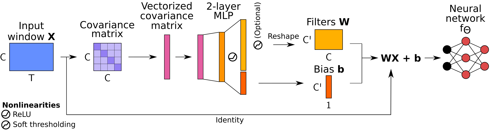

# Dynamic spatial filtering

Code for Banville et al., ["Robust learning from corrupted EEG with dynamic spatial filtering"](https://www.sciencedirect.com/science/article/pii/S1053811922001239), NeuroImage, 2022.

> **tl;dr**
We introduce a spatial attention block that dynamically handles corrupted EEG channels by predicting spatial filters on a window-by-window level. This dynamic spatial filtering (DSF) block is trained end-to-end on the predictive task with data augmentation, and its attention values can be visualized to understand which channels are important.



## Running the experiments

Once this repository has been cloned locally, the denoising experiments on neural architectures can be run with the following:
> :warning: This will download the training split of the PC18 dataset (~135 GB), preprocess and cache the preprocessed data, then train 9 models and test their performance under 5 corruption levels. For a quick test, run the `experiments/pc18_debug.sh` version which downloads and works on only 3 recordings.

```
cd dynamic-spatial-filtering
pip install -r requirements.txt
bash experiments/pc18.sh
```

Outputs will be found under `runs/`.

If the PC18 dataset is already available locally, first set the following environment variable to the directory containing PC18's `training` directory to avoid re-downloading the data:
```
export PC18_DATASET_PATH=<path to the directory, e.g. /pc18/1.0.0/>
```

By default, the training script will cache the preprocessed data in the working directory to speed up future experiments. To change the directory into which the data should be cached, set the following environment variable:
```
export JOBLIB_CACHE_DIR=<path to the directory>
```
To disable caching, set the environment variable to 'none':
```
export JOBLIB_CACHE_DIR=none
```

## Citation

```
@article{banville2022robust,
  title={Robust learning from corrupted EEG with dynamic spatial filtering},
  author={Banville, Hubert and Wood, Sean U. N. and Aimone, Chris and Engemann, Denis-Alexander and Gramfort, Alexandre},
  journal={NeuroImage},
  volume={251},
  pages={118994},
  year={2022},
  publisher={Elsevier}
}
```
